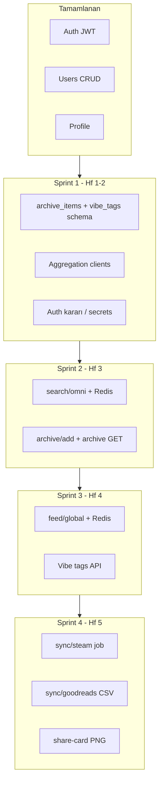

# Archi Backend — PRD Analizi ve 6 Haftalık MVP Planı

**Kaynak:** [Teknik PRD_ Archi.md](./Teknik%20PRD_%20Archi.md)  
**Kod tabanı:** `backend/`  
**Son güncelleme:** Mayıs 2026

Bu doküman, Teknik PRD ile mevcut backend durumunun karşılaştırmasını ve 6 haftalık MVP sprint planını içerir. İlerleme **Sprint 1–2 altındaki To-Do listelerinden** (`[ ]` / `[x]`) işaretlenir; §12 haftalık notlar isteğe bağlı özet içindir.

---

## 1. Mevcut durum özeti

| Alan | PRD hedefi | Mevcut durum |
|------|------------|--------------|
| Runtime | .NET 8 Web API | **.NET 9** minimal API (`Program.cs`) |
| Veritabanı | PostgreSQL | **EF Core + Npgsql** (Supabase) |
| Cache | Redis | **Yok** |
| Auth | Firebase (Google/Apple) | **E-posta/şifre + JWT** (BCrypt) |
| Swagger | Dokümante API | **Var** |
| Test | Kritik logic için unit test | **11 test** (auth, profile, user CRUD) |

### Çalışan endpoint'ler

| Endpoint | Durum |
|----------|--------|
| `POST /api/v1/auth/register`, `POST /api/v1/users` | Tamam |
| `POST /api/v1/auth/login` | Tamam |
| `GET/PATCH /api/v1/profile`, `/profile/privacy` | Tamam |
| `GET/PUT/DELETE /api/v1/users/{id}`, `GET /api/v1/users` | Tamam (PRD'de açık yok; ek geliştirme) |
| `GET /api/v1/health` | Tamam |

### PRD'de olup backend'de olmayanlar

| PRD bölümü | Eksik |
|------------|--------|
| `GET /api/v1/search/omni` | Aggregation + Redis cache |
| `POST /api/v1/archive/add`, `GET /api/v1/archive/{userId}` | Model, tablo, endpoint |
| `GET /api/v1/feed/global` | Dapper + Redis + cursor pagination |
| `POST /api/v1/sync/steam`, `POST /api/v1/sync/goodreads` | Background job, parser |
| `GET /api/v1/share-card/{itemId}` | PNG render (SkiaSharp vb.) |
| Tablolar `archive_items`, `vibe_tags` | Entity + migration yok |
| Redis | Paket / yapılandırma yok |
| Dış API'ler (TMDB, Books, IGDB) | Entegrasyon yok |

### `users` tablosu — PRD vs kod

| PRD | Kod (Supabase) | Not |
|-----|----------------|-----|
| `id`, `oauth_id`, `email`, `is_vault_member`, `created_at` | Var (+ `Username`, `PasswordHash`, `IsPrivate`, normalized alanlar) | MVP auth için genişletilmiş |
| Firebase `oauth_id` zorunlu | `OauthId` nullable | Firebase geçişinde doldurulmalı |

`CreatedAt` → `[Column("created_at")]`. Diğer sütunlar PascalCase ile Supabase şemasına eşlendi.

---

## 2. Mimari hedef (PRD)

```
Flutter App
    │
    ▼
.NET Web API  ──▶  Redis Cache
    │
    ├──▶ Aggregation Layer
    │       ├── TMDB API         (Film/Dizi)
    │       ├── Google Books API (Kitap)
    │       └── IGDB API         (Oyun)
    │
    └──▶ PostgreSQL
```

**Prensipler:**
- Aggregation Layer dış API'ları normalize eder; istemci tek `/search/omni` çağırır.
- Feed ve arama Redis üzerinden döner.
- Dış API anahtarları yalnızca backend'de tutulur.

---

## 3. Sprint bağımlılık akışı



---

## 4. Sprint planı (6 hafta MVP)

### Sprint 1 — Şema + Aggregation iskeleti (Hafta 1–2)

**Hedef:** Veri modeli ve dış API katmanı; auth/DB temeli sağlam.

| # | İş | Çıktı | Öncelik | Durum |
|---|-----|--------|---------|--------|
| 1.1 | `ArchiveItem`, `VibeTag` entity + EF migration | `archive_items`, `vibe_tags` | P0 | ✅ |
| 1.2 | JSONB `metadata` (Npgsql) | Film/kitap/oyun meta | P0 | ✅ |
| 1.3 | TMDB, Google Books, IGDB HTTP client'ları | Normalize DTO | P0 | ✅ |
| 1.4 | `IOmniSearchService` + paralel sorgu | Aggregation iskeleti | P0 | ✅ |
| 1.5 | Auth kararı (Firebase vs JWT) | Geçiş planı dokümante | P1 | ✅ |
| 1.6 | Secret'ları env'e taşı | JWT, DB, API keys | P1 | ✅ |

#### Sprint 1 — Teknik To-Do (işaretleyerek ilerleyin)

**1.1 — `ArchiveItem`, `VibeTag` entity + EF migration**

- [x] `Models/ArchiveItem.cs`: `Id`, `UserId` (FK → users), `ExternalId`, `Category`, `Title`, `Metadata`, `Status` (enum/smallint), `ReferralUrl`, `CreatedAt`
- [ ] `Models/VibeTag.cs`: `Id`, `ItemId` (FK → archive_items), `TagName` (max 30), `CreatedAt`
- [ ] `ArchiveItemStatus` enum: `Wishlist = 0`, `InProgress = 1`, `Done = 2` (PRD §5)
- [ ] `AppDbContext`: `DbSet<ArchiveItem>`, `DbSet<VibeTag>`; tablo adları `archive_items`, `vibe_tags`
- [ ] Fluent API: PK, FK `user_id` → `users`, FK `item_id` → `archive_items`, `OnDelete` davranışı (Cascade/Restrict kararı)
- [ ] Index: `archive_items(external_id)`, `vibe_tags(tag_name)`; unique `(user_id, external_id, category)` → **1.1 veya 2.6'da** (tercihen burada tanımla)
- [ ] `dotnet ef migrations add AddArchiveAndVibeTags` + `AppDbContextModelSnapshot` güncelle
- [ ] Dev Supabase'e migration uygula (`dotnet ef database update` veya onaylı SQL)
- [ ] Mevcut `users` migration'ları ile çakışma yok — smoke: API ayağa kalkıyor

**1.2 — JSONB `metadata` (Npgsql)**

- [ ] `ArchiveItem.Metadata` → `JsonDocument` veya strongly-typed `ArchiveMetadata` + Npgsql JSONB mapping
- [ ] Fluent API: `.HasColumnType("jsonb")`, sütun adı `metadata`
- [ ] `Contracts/Archive/ArchiveMetadataDto.cs` (ortak alanlar: `coverUrl`, `year`, `author` / `director` / `platform` vb.)
- [ ] Kategori bazlı alt şema notu (movie / book / game) — Swagger örneği veya XML doc
- [ ] Serialization testi: round-trip JSONB okuma/yazma (unit veya migration sonrası manuel)

**1.3 — TMDB, Google Books, IGDB HTTP client'ları**

- [ ] NuGet: gerekirse `Microsoft.Extensions.Http`, `Polly` (retry — opsiyonel S1)
- [ ] `Options/ExternalApiOptions.cs` + `TmdbOptions`, `GoogleBooksOptions`, `IgdbOptions` (`IOptions<T>`)
- [ ] `Services/Search/ITmdbClient.cs` + implementasyon: arama endpoint, API key query/header
- [ ] `Services/Search/IGoogleBooksClient.cs` + implementasyon: volume search
- [ ] `Services/Search/IIgdbClient.cs` + implementasyon: OAuth2 client credentials → search
- [ ] Normalize DTO: `Contracts/Search/ExternalMediaItemDto.cs` (`ExternalId`, `Category`, `Title`, `Metadata` alt kümesi)
- [ ] Her client için mapping fonksiyonu (ham API → `ExternalMediaItemDto`)
- [ ] `IHttpClientFactory` ile named client'lar; timeout (ör. 5 sn) ve User-Agent
- [ ] **Stub modu:** `ExternalApi:UseStubs=true` iken sabit fixture dön (CI / key yokken)
- [ ] Unit test: `HttpMessageHandler` mock ile 3 client ayrı ayrı

**1.4 — `IOmniSearchService` + paralel sorgu**

- [ ] `Services/Search/IOmniSearchService.cs`: `Task<OmniSearchResponse> SearchAsync(string query, CancellationToken ct)`
- [ ] `OmniSearchService`: `Task.WhenAll` ile TMDB + Books + IGDB paralel çağrı
- [ ] Kısmi hata: bir provider fail → diğerleri dönsün; hata log + boş kategori (PRD dayanıklılık)
- [ ] `Contracts/Search/OmniSearchResponse.cs`: kategori grupları (`movies`, `books`, `games`)
- [ ] DI kaydı: `builder.Services.AddScoped<IOmniSearchService, OmniSearchService>()`
- [ ] Unit test: 3 mock client, paralel çağrı ve gruplama doğrulanır
- [ ] *(Endpoint S2'de; S1'de servis hazır, endpoint yok)*

**1.5 — Auth kararı (Firebase vs JWT)**

- [ ] Karar dokümanı: `docs/auth-strategy.md` veya bu dosyada §8 altına 1 paragraf **Seçilen yol**
- [ ] **JWT devam:** `OauthId` nullable kalır; Firebase geçişi için `POST /auth/firebase-exchange` taslağı (Faz 2)
- [ ] **Firebase geçiş:** Admin SDK / JWKS doğrulama spike; `users.oauth_id` zorunluluk planı
- [ ] Flutter + backend uyumu: hangi token `Authorization` header'da gidecek
- [ ] PRD §US-101 acceptance criteria ile gap listesi (email login kalacak mı?)

**1.6 — Secret'ları env'e taşı**

- [ ] `Jwt:SigningKey`, `Issuer`, `Audience` → ortam değişkeni (`Jwt__SigningKey` vb.)
- [ ] `ConnectionStrings:DefaultConnection` → env; `appsettings.json` içinde gerçek secret kalmamalı
- [ ] `Tmdb:ApiKey`, `GoogleBooks:ApiKey`, `Igdb:ClientId` / `ClientSecret` → env şablonu
- [ ] `.env.example` veya `README` backend bölümü: gerekli değişken listesi
- [ ] `appsettings.Development.json`: yalnızca local override; commit'te placeholder
- [ ] Render / deploy dokümantasyonu: secret injection notu (S5 ile uyumlu)

**Kabul:** Migration uygulanır; 3 dış API stub ile test; mevcut auth testleri yeşil.

**Önerilen klasör yapısı:**

```
Archi.Api/
  Models/          ArchiveItem.cs, VibeTag.cs
  Contracts/       Search/, Archive/
  Services/        Search/, Archive/, Cache/
  Data/            AppDbContext.cs
```

---

### Sprint 2 — Omni-Search + Arşiv (Hafta 3)

**Hedef:** US-201, US-202 backend tarafı.

| # | İş | Çıktı | KPI | Durum |
|---|-----|--------|-----|--------|
| 2.1 | Redis entegrasyonu | DI + connection | — | ✅ |
| 2.2 | `GET /api/v1/search/omni?q=` | Kategori gruplu; cache 5 dk | < 800 ms | ✅ |
| 2.3 | IGDB rate limit / throttle | PRD risk önlemi | — | ✅ |
| 2.4 | `POST /api/v1/archive/add` | JWT; external_id, category, status, tags | — | ✅ |
| 2.5 | `GET /api/v1/archive/{userId}` | Arşiv listesi | — | ✅ |
| 2.6 | Duplicate kontrolü | unique (user_id, external_id, category) | — | ✅ |
| 2.7 | Integration testler | Search + archive | DoD | ✅ |

#### Sprint 2 — Teknik To-Do (işaretleyerek ilerleyin)

**2.1 — Redis entegrasyonu**

- [ ] NuGet: `Microsoft.Extensions.Caching.StackExchangeRedis` (veya `StackExchange.Redis` doğrudan)
- [ ] `Cache:Redis:ConnectionString` config + env override
- [ ] `builder.Services.AddStackExchangeRedisCache(...)` veya `IConnectionMultiplexer` singleton
- [ ] `Services/Cache/ICacheService.cs` wrapper: `GetAsync` / `SetAsync` / key prefix `archi:`
- [ ] Local dev: Docker `redis:alpine` veya Upstash bağlantı notu
- [ ] Redis kapalıyken graceful degrade (in-memory veya cache bypass — geliştirme modu)
- [ ] *(Opsiyonel)* `GET /api/v1/health` Redis ping genişletmesi

**2.2 — `GET /api/v1/search/omni?q=`**

- [ ] Minimal API route: `MapGet("/api/v1/search/omni", ...)` — auth gereksinimi PRD'ye göre (genelde anonim OK)
- [ ] Query validation: `q` boş/whitespace → `400 Bad Request`
- [ ] Cache key: `search:omni:{normalizedQuery}` (lowercase, trim); TTL **5 dakika**
- [ ] Cache-aside: Redis hit → dön; miss → `IOmniSearchService.SearchAsync` → set → dön
- [ ] Response: kategori gruplu JSON (`OmniSearchResponse`); Swagger örneği
- [ ] Süre ölçümü: log veya `Stopwatch`; hedef **< 800 ms** (PRD 500 ms + ağ payı)
- [ ] `[Authorize]` gerekmiyorsa dokümante et; rate limit backlog (P2)

**2.3 — IGDB rate limit / throttle**

- [ ] IGDB için `SemaphoreSlim(1,1)` veya token bucket (ör. max N req/sn)
- [ ] OAuth token cache: memory + Redis (token süresi dolmadan yenileme)
- [ ] Polly: 429 / 503 → exponential backoff (max 2–3 deneme)
- [ ] Uzun sorguda diğer provider'lar bloklanmasın (`WhenAll` + ayrı timeout)
- [ ] Unit/integration test: mock 429 sonrası retry veya boş kategori

**2.4 — `POST /api/v1/archive/add`**

- [ ] `Contracts/Archive/AddArchiveRequest.cs`: `externalId`, `category`, `title`, `metadata`, `status`, `tags[]`, `referralUrl?`
- [ ] `Contracts/Archive/ArchiveItemResponse.cs` (dönüş DTO)
- [ ] `[Authorize]` + JWT `sub` → `user_id` (mevcut `CreateJwtToken` claim yapısıyla uyum)
- [ ] `ArchiveService.AddAsync`: entity oluştur, `SaveChanges`
- [ ] Vibe tag'ler: istekteki `tags` → `vibe_tags` insert (max 30 char, trim, lowercase normalize kararı)
- [ ] `metadata` request body → JSONB persist
- [ ] `201 Created` + `Location` veya body'de `id`
- [ ] Hata: `401` (token yok), `400` (validation), `409` (duplicate — 2.6)

**2.5 — `GET /api/v1/archive/{userId}`**

- [ ] Route: `userId` GUID parse; geçersiz → `400`
- [ ] Yetki: kendi arşivi veya hedef kullanıcı `IsPrivate == false` (profil gizlilik kuralı ile aynı mantık)
- [ ] Sorgu: `archive_items` where `user_id`, `Include` vibe tags veya projection
- [ ] Sıralama: `created_at DESC`
- [ ] *(Opsiyonel S2)* `?limit=` / `?cursor=` — tam pagination S3'e kalabilir; en az `limit` default 50
- [ ] Response: `ArchiveListResponse` — item listesi + tag isimleri
- [ ] Başka kullanıcı private → `404` veya `403` (mevcut profile API ile tutarlı seç)

**2.6 — Duplicate kontrolü**

- [ ] DB unique index: `(user_id, external_id, category)` — migration'da yoksa ekle
- [ ] `AddAsync` öncesi existence check (opsiyonel, index yeterli)
- [ ] `DbUpdateException` (23505) → `409 Conflict` + anlamlı `ErrorResponse`
- [ ] Integration test: aynı `external_id` + `category` iki kez → ikinci `409`

**2.7 — Integration testler**

- [ ] `WebApplicationFactory` fixture: test DB veya InMemory (JSONB kısıtına dikkat; tercih testcontainers Postgres)
- [ ] Test: login → JWT → `POST archive/add` → `GET archive/{userId}` liste içerir
- [ ] Test: `GET search/omni?q=matrix` → 200, en az bir kategori (stub ile deterministic)
- [ ] Test: aynı sorgu iki kez → ikinci yanıt cache'ten (Redis mock veya `IDistributedCache` fake)
- [ ] Test: duplicate archive → `409`
- [ ] CI: mevcut `Archi.Api.Tests` projesine ekle; `dotnet test` yeşil

---

### Sprint 3 — Feed + Vibe (Hafta 4)

**Hedef:** US-401, US-402.

| # | İş | Çıktı | KPI | Durum |
|---|-----|--------|-----|--------|
| 3.1 | `GET /api/v1/feed/global` | Son 24 saat / son 20 kayıt | < 300 ms | ✅ |
| 3.2 | Dapper veya EF raw SQL | Performanslı feed sorgusu | — | ✅ |
| 3.3 | Redis feed cache TTL 60 sn | `feed:global:cursor` | — | ✅ |
| 3.4 | Cursor-based pagination | `?cursor=&limit=` | Sonsuz scroll | ✅ |
| 3.5 | Vibe: ekleme + top 5 tag | `vibe_tags` | US-402 | ✅ |

---

### Sprint 4 — Sync + Share Card (Hafta 5)

**Hedef:** US-301, US-302, US-403.

| # | İş | Çıktı | KPI | Durum |
|---|-----|--------|-----|--------|
| 4.1 | Background job altyapısı | Steam sync async | 500 oyun < 10 sn | ✅ |
| 4.2 | `POST /api/v1/sync/steam` | Job id / status / retry | — | ✅ |
| 4.3 | `POST /api/v1/sync/goodreads` | CSV parse + bulk insert | 500 kayıt < 30 sn | ✅ |
| 4.4 | Esnek CSV parser | Goodreads/Letterboxd | — | ✅ |
| 4.5 | `GET /api/v1/share-card/{itemId}` | SkiaSharp 1080×1920 PNG | < 2 sn | ✅ |
| 4.6 | Sync başarı metrikleri | ≥ %95 | — | ✅ |

---

### Sprint 5 — QA ve canlıya alma (Hafta 6)

| # | İş | Durum |
|---|-----|--------|
| 5.1 | Load test (search, feed) — k6 / NBomber | ⬜ |
| 5.2 | Docker + Render deploy | ⬜ |
| 5.3 | Keep-alive ping (cold start) | ⬜ |
| 5.4 | Swagger / Postman collection güncel | ⬜ |
| 5.5 | Supabase prod migration stratejisi | ⬜ |

---

## 5. Veritabanı şeması (PRD — hedef)

### `archive_items`

| Sütun | Tip | Özellik |
|-------|-----|---------|
| id | UUID | PK |
| user_id | UUID | FK → users |
| external_id | VARCHAR | Index |
| category | VARCHAR | movie / book / game |
| title | VARCHAR | Not Null |
| metadata | JSONB | Kapak, yıl, yazar vb. |
| status | SMALLINT | 0:Wishlist, 1:In Progress, 2:Done |
| referral_url | VARCHAR | Affiliate (placeholder) |
| created_at | TIMESTAMPTZ | Default: now() |

### `vibe_tags`

| Sütun | Tip | Özellik |
|-------|-----|---------|
| id | UUID | PK |
| item_id | UUID | FK → archive_items |
| tag_name | VARCHAR(30) | Index |
| created_at | TIMESTAMPTZ | Default: now() |

---

## 6. API uç noktaları (PRD checklist)

| Metot | Yol | Sprint | Durum |
|-------|-----|--------|--------|
| GET | `/api/v1/search/omni?q=` | S2 | ✅ |
| POST | `/api/v1/archive/add` | S2 | ✅ |
| GET | `/api/v1/archive/{userId}` | S2 | ✅ |
| GET | `/api/v1/feed/global` | S3 | ✅ |
| POST | `/api/v1/sync/steam` | S4 | ✅ |
| GET | `/api/v1/sync/jobs/{jobId}` | S4 | ✅ |
| POST | `/api/v1/sync/jobs/{jobId}/retry` | S4 | ✅ |
| POST | `/api/v1/sync/goodreads` | S4 | ✅ |
| GET | `/api/v1/share-card/{itemId}` | S4 | ✅ |

**Mevcut (auth / kullanıcı):** register, login, profile, users CRUD, health — **tamam**.

---

## 7. Kapsam dışı (Faz 1)

PRD §10 — bu fazda backend'e eklenmeyecek:

- Podcast / Spotify entegrasyonu
- Manuel içerik girişi (yalnızca API destekli içerik)
- Premium Vault özellikleri (`IsVaultMember` alanı var; iş mantığı Faz 2)
- Push notification
- Dark/Light tema geçişi

---

## 8. Teknik borç ve riskler

| Konu | Etki | Öneri |
|------|------|--------|
| PRD Firebase vs mevcut JWT | US-101 | Kısa vadede JWT; sonra `oauth_id` + token exchange |
| .NET 8 vs 9 | Düşük | PRD güncelle veya `net8.0` hedefle |
| Migration vs Supabase manuel şema | Orta | Tek kaynak: EF veya Supabase SQL |
| Secret'lar `appsettings` içinde | Yüksek | Environment variable |
| Redis yokken search/feed KPI | Yüksek | S2 öncesi Redis şart |
| Steam scraping riski | Yüksek | Resmi Steam Web API planı |

---

## 9. Öncelik backlog (özet)

```
P0  archive_items + vibe_tags migration
P0  Archive add/list API
P0  TMDB + Books + IGDB clients
P0  GET /search/omni + Redis
P1  GET /feed/global + cursor + Redis
P1  Vibe tag endpoints
P2  sync/steam (background job)
P2  sync/goodreads (CSV)
P2  share-card PNG
P3  Firebase auth (PRD uyumu)
P3  Dapper feed (performans ihtiyacı doğarsa)
```

---

## 10. Tahmini iş yükü

| Sprint | Backend (1 dev, gün) | Bağımlılık |
|--------|----------------------|------------|
| S1 | 8–12 | Supabase şema onayı |
| S2 | 10–14 | Redis, API keys |
| S3 | 6–10 | S2 archive verisi |
| S4 | 12–16 | S2–S3 |
| S5 | 5–8 | Tüm API |

---

## 11. Definition of Done (PRD §12)

Bir story tamam sayılır:

1. Tüm acceptance criteria geçiyor.
2. Kritik business logic için unit test yazıldı.
3. Swagger/Postman ile API dokümante edildi.
4. Performans KPI'ları karşılanıyor (load test).
5. Kod review tamamlandı ve merge edildi.

---

## 12. Haftalık notlar

> Bu bölümü sprint ilerledikçe doldurun.

### Hafta 1–2 (Sprint 1)

- 

### Hafta 3 (Sprint 2)

- 

### Hafta 4 (Sprint 3)

- 

### Hafta 5 (Sprint 4)

- 

### Hafta 6 (Sprint 5)

- 

---

## 13. Sonuç

**Şu an:** Auth, kullanıcı CRUD ve profil katmanı hazır; Flutter login/kayıt bağlanabilir.

**Eksik çekirdek:** Aggregation arama, arşiv CRUD, global feed, vibe, sync ve share card — yeni domain modelleri + Redis + dış API entegrasyonları gerektirir.

**Önerilen ilk kod adımı:** Sprint 1 — `ArchiveItem` + `VibeTag` entity, migration ve `POST /api/v1/archive/add` iskeleti.
